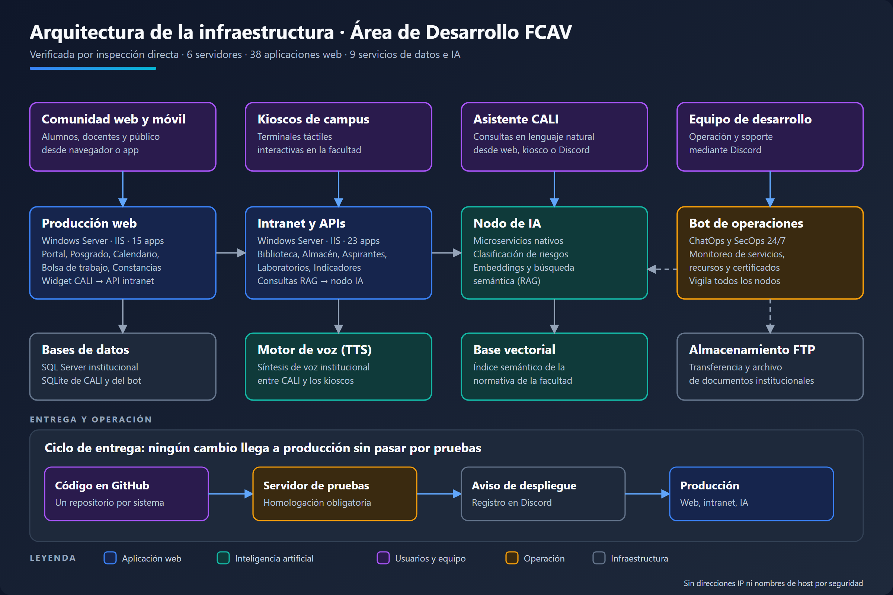

# Área de Desarrollo — FCAV

**Facultad de Comercio y Administración Victoria · UAT**
Desarrollo, operación y soporte de los sistemas web institucionales

---

## Qué hacemos

Somos el área que construye y mantiene los sistemas que usa a diario la comunidad de la
facultad: portal institucional, inscripciones y control escolar, biblioteca, almacén,
bolsa de trabajo, constancias, laboratorios y el asistente virtual **CALI**, que responde
consultas sobre la normativa de la facultad.

Operamos sobre **Windows Server con IIS**, con un nodo dedicado a inteligencia artificial.

---

## Arquitectura de la infraestructura

Verificada por inspección directa de los servidores en octubre de 2026. Por seguridad
no se publican direcciones IP, nombres de host ni credenciales. [Ver en vector (SVG)](https://github.com/Desarrollo-de-software-FCAV/.github/blob/main/profile/diagrama-infraestructura.svg).

**Cómo leerla:**

| Capa | Qué contiene |
|---|---|
| **Quién usa los sistemas** | Comunidad (web y móvil), kioscos de campus, asistente CALI y el propio equipo vía Discord |
| **Plataforma** | Producción web (15 apps), intranet y APIs (23 apps), nodo de IA y bot de operaciones |
| **Datos y apoyo** | SQL Server y SQLite, base vectorial del RAG, motor de voz, almacenamiento institucional |
| **Entrega** | Código en GitHub → servidor de pruebas → aviso de despliegue → producción |

---

## Cifras del área

| | |
|:--|:--|
| **38** | aplicaciones web |
| **6** | servidores operados |
| **9** | servicios de datos e inteligencia artificial |
| **17** | proyectos en el portafolio |
| **12** | repositorios |

---

## Proyectos

### Sistemas institucionales

| Proyecto | Descripción |
|---|---|
| Portal institucional | Punto de entrada público a los servicios de la facultad |
| Control escolar | Inscripción, asistencia docente y evaluación |
| Aspirantes | Proceso de ingreso y admisión |
| Biblioteca | Consulta de acervos, préstamos y tesis históricas |
| Constancias | Emisión y validación de constancias |
| Bolsa de trabajo | Vinculación de egresados con empleadores |
| Congreso | Plataforma del encuentro académico anual |

### Plataforma y servicios

| Proyecto | Descripción |
|---|---|
| **CALI** | Asistente virtual con búsqueda semántica (RAG) sobre normativa y documentos, con voz |
| Kioscos | Terminales táctiles en campus, incluido el kiosco de biblioteca |
| App móvil | Servicios al estudiante desde el dispositivo |
| Almacén | ERP de entradas, salidas y existencias |
| Mobiliario | Control de activo fijo y mobiliario |

### Operación

| Proyecto | Descripción |
|---|---|
| Bot de operaciones | ChatOps y SecOps, alertas de servicio y despliegue |
| Monitoreo | Vigilancia de recursos, servicios, puertos y certificados |

---

## Hacia dónde vamos

- **Migrar los sistemas heredados a ASP.NET Core / MVC**, empezando por los kioscos y la biblioteca
- **Un repositorio por sistema**, con historial, revisión de cambios y reversión
- **Respaldos automatizados y verificados** de bases de datos, base vectorial y configuración
- **Registros de eventos estandarizados** para diagnosticar incidentes con rapidez
- **App móvil unificada** para biblioteca, inscripciones y consulta del alumno
- **Documentación por sistema**, para que el conocimiento no dependa de una sola persona

---

## Stack

| Capa | Tecnología |
|---|---|
| **Servidor** | Windows Server · IIS |
| **Aplicaciones** | ASP.NET · ASP.NET Core |
| **Datos** | SQL Server · SQLite · base vectorial |
| **IA** | Embeddings, RAG y clasificación de riesgos |
| **Clientes** | React · Node.js |
| **Operación** | PowerShell · Discord · GitHub |

---

## Cómo trabajamos

- **Un repositorio por sistema**, con su propio ciclo de vida
- **Entorno de pruebas dedicado** — nada llega a producción sin validarse antes
- **Revisión por pull request** — se trabaja en ramas, no directo sobre `main`
- **Sin secretos en el código** — credenciales fuera de los repositorios, siempre
- **Documentación junto al código** — qué es cada sistema, dónde vive y de qué depende
- **Cambios trazados** — cada despliegue queda registrado

---

## Contacto y reportes

| Necesitas | Cómo |
|---|---|
| Reportar una falla o pedir soporte de un sistema | Por los canales institucionales de la facultad, vía [fcav.uat.edu.mx](https://fcav.uat.edu.mx) |
| Reportar una **vulnerabilidad** | De forma **privada** al área de desarrollo. Ver [SECURITY.md](https://github.com/Desarrollo-de-software-FCAV/.github/blob/main/SECURITY.md). No la publiques en un issue |
| Colaborar o hacer prácticas con nosotros | Escribe al área de desarrollo a través de la facultad |

Los repositorios de los sistemas son **privados**: contienen la lógica interna de la
institución. Este perfil es la vitrina pública del área.

---

Área de Desarrollo · Facultad de Comercio y Administración Victoria · Universidad Autónoma de Tamaulipas

